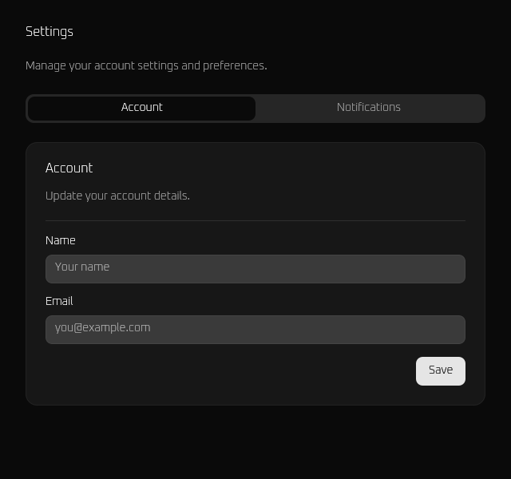

# egui-shadcn

A [Claude Code](https://claude.com/claude-code) plugin that lets Claude build
polished Rust [egui](https://github.com/emilk/egui)/eframe GUIs from
[shadcn/ui](https://ui.shadcn.com/) designs — without the usual endless iteration.

## Why

egui is an immediate-mode GUI toolkit with no flexbox and no CSS, and there is
little reference code showing how to make it look *modern*. So building a nice
egui UI from a web design normally means many rounds of guess-and-tweak.

This plugin fixes that by shipping three things:

1. **A tested, compiling component module** (`registry/`) that ports the
   shadcn-v4 (new-york / OKLCH) design system to egui — theme & tokens, a
   flexbox-substitute layout layer, and themed components (Button, Input, Label,
   Card, Tabs, Switch, Checkbox, Select, Separator, Badge).
2. **A layout-first workflow** (`skills/egui-shadcn/SKILL.md`): vendor the module
   into your project → decompose the design top-down → map it with the reference
   tables → build from the tested parts → verify with a headless render.
3. **Reference tables**: shadcn-token → egui field, web-layout-intent → egui
   helper, component → widget, and the egui gotchas that trip up web habits.

The key unlock is a **web-like feedback loop**: components render headlessly to
PNG via [`egui_kittest`](https://docs.rs/egui_kittest), so Claude can *look at its
own output and self-correct* instead of guessing.

## The reference screen

The skill is validated against a settings-form-with-tabs screen, built entirely
from the module:



This is the actual `egui_kittest` snapshot render (dark theme, Oxanium type). Run
it live:

```bash
cargo run --example settings
```

## Install (as a Claude Code plugin)

```
/plugin marketplace add oposs/claude-plugins
/plugin install egui-shadcn@oposs-plugins
```

Then just ask Claude things like:

- *"Build an egui settings screen with tabs from this shadcn design"* (attach a screenshot)
- *"Port this shadcn Card + form to egui"*
- *"Make my eframe app look like shadcn"*

## Repository layout

| Path | What |
|------|------|
| `src/`, `examples/`, `tests/` | The canonical `egui_shadcn` crate (source of truth) + the live example + `egui_kittest` snapshot tests |
| `skills/egui-shadcn/` | The plugin skill: `SKILL.md`, `references/`, and the vendored `registry/` copied into target projects |
| `docs/superpowers/` | Design spec and implementation plan |

## Licenses

- Code: MIT (see `LICENSE`).
- The bundled **Oxanium** font is licensed under the SIL Open Font License 1.1
  (see `assets/Oxanium-OFL.txt`).

---

Built with [Claude Code](https://claude.com/claude-code).
